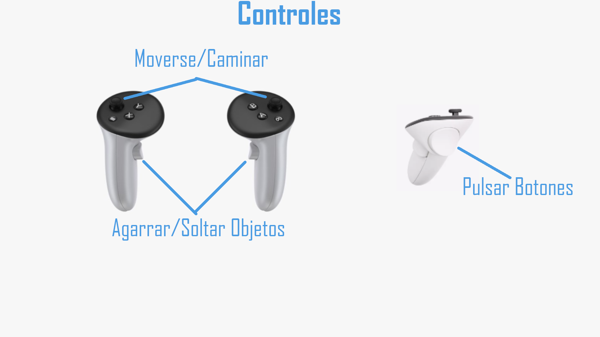

# SomewhereOstFront

Proyecto de Realidad Virtual desarrollado por un estudiante de la Universidad de Alicante.

## Descripción de la experiencia

El jugador se encuentra en una base aliada con la misión de ensamblar un tanque. Para completar esta tarea, deberá explorar el entorno recogiendo munición pasando por encima, 
tendra que coger las diferentes piezas de tanque necesarias y soltarlas en la zona de ensamblaje.
Una vez completado el ensamblaje y recolectada la munición suficiente, la experiencia finalizará.

## Cómo jugar / Controles

A continuación se muestran los controles básicos del juego:

## Licencias

Este proyecto ha sido desarrollado con fines educativos y no tiene fines comerciales. Las herramientas utilizadas, como Unreal Engine y el plugin MetaXR, están sujetas a sus respectivas licencias de uso.

En la carpeta "Assets" que se ubica en Project/Content/Assets podremos encontrar diferentes carpetas donde las siguientes contienen modelos externos:

Ammo: Caja de munición licencia tipo CC Atribution - link del modelo y creador: https://sketchfab.com/3d-models/free-ammo-box-rocket-low-poly-c56e5719dc3049b8bede66e56712d8a8

Barricade: Barricada licencia tipo CC Atribution - link del modelo y creador: https://sketchfab.com/3d-models/free-barricade-b7b92195d90e40ca99eece53b0de6314

Hangar: Hangar licencia tipo CC Atribution - link del modelo y creador:https://sketchfab.com/3d-models/sci-fi-hangar-0625335964a5496980ccfbc3b76c49ff

Landscape: Paisaje licencia tipo CC Atribution - link del modelo y creador:https://sketchfab.com/3d-models/mossygrassy-landscape-8f9a3ceee63747eea04c4b6ad2e5f5e2

CombinedStaticMesh, TigerTank, y TigerTankMesh: Todas estas carpetas contienen un modelo de un tanque o sus partes licencia tipo CC Atribution - link del modelo y creador: https://sketchfab.com/3d-models/tiger-i-panzer-vi-tiger-low-poly-2adadbe22f2c43f8a229d4b082564a89

Tree: Arbol licencia tipo CC Atribution - link del modelo y creador: https://sketchfab.com/3d-models/realistic-tree-2-free-2cd58e603ae542c78dd9cada46496921

En la carpeta "Sound" que se ubica en "Project/Content/Assets/Sound" podremos encontrar diferentes audios externos:
SW_Ambient: Sonido de ambiente licencia tipo CC 0 - link del sonido y creador: https://freesound.org/people/kvgarlic/sounds/386922/

SW_Reload: Sonido de coger munición licencia tipo CC 0 - link del sonido y creador: https://freesound.org/people/ken788/sounds/386744/

SW_Step: Sonido de pasos licencia tipo Attribution 4.0  - link del sonido y creador: https://freesound.org/people/spycrah/sounds/535220/

# Entrevista

## Descripción del proceso de creación

Durante el desarrollo de **SomewhereOstFront**, me enfrenté a varios dificultades:

### Dificultades encontradas

1. **Falta de hardware VR:** No disponía de unas gafas de realidad virtual, lo cual dificultaba el desarrollo de una experiencia inmersiva y sentía que programaba "a ciegas".
2. **Aprendizaje de Blueprints:** Fue mi primer contacto con los Blueprints de Unreal Engine, por lo que tuve que aprender su lógica desde cero.

### Cómo se resolvieron

1. **Uso del simulador MetaXR:** Instalé el plugin de MetaXR en Unreal Engine, que incluye un simulador de VR que me permitió probar funcionalidades como agarre de objetos, movimiento y navegación por interfaces.
2. **Práctica constante:** Dediqué tiempo a experimentar con los Blueprints, consultando documentación oficial y ejemplos para entender su funcionamiento.

## Siguientes pasos

Si hubiera contado con más tiempo, me habría gustado implementar las siguientes mejoras:

- **Minijuegos al ensamblar:** Añadir minijuegos a la hora de ensamblar para entender la mecanica de un tanque.
- **Modo artillero:** Añadir una vista en primera persona como artillero al finalizar el ensamblaje del tanque.
- **Nivel adicional:** Incluir una misión extra en la que el jugador tenga que destruir otros tanques u objetivos enemigos.

